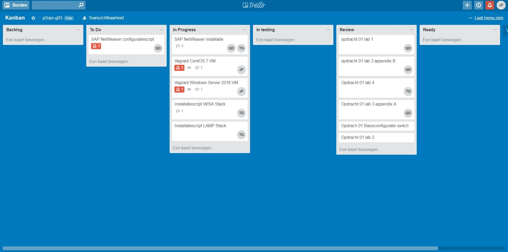

# Voortgangsrapport week 04

* Groep: ops2-g03
* Datum: 5/03/2018

| Student  | Aanw. | Opmerking |
| :---     | :---  | :---      |
| Quinten De Bruyne |  nvt     |           |
| Jens Du Four |  ziek   | gewettigd, blessure          |
| Tim Grijp |  nvt     |           |

## Wat heb je deze week gerealiseerd
Begonnen aan opdracht 2. Installeren van WISA en LAMP op bijhorende besturingsysteem zowel manueel als aan de hand van installatiescripts.
Alsook de laatste onderdelen afwerken van opdracht 1.

### Algemeen

* ...
* ...

[Afbeelding teamoverzicht tijdregistratie onderverdeeld per deelopdracht]

### Quinten De Bruyne

* ...

[Afbeelding individueel rapport tijdregistratie]

### Jens Du Four

[Afbeelding individueel rapport tijdregistratie]

### Tim Grijp

*

[Afbeelding individueel rapport tijdregistratie]

## Wat plan je volgende week te doen?

### Algemeen
Verder afwerken van opdracht 2, zorgen dat we na week 5 hiermee klaar zijn en ons kunnen voorbereiden op een volgende opdracht.

### Quinten De Bruyne

### Jens Du Four
Aanvullen van de benodigde informatie op Github: lastenboek, achtergrondinformatie, technische handleiding en handleiding voor gebruikers.

### Tim Grijp

SAP Installeren en testen van de WISA en LAMP installatiescripts

## Waar hebben jullie nog problemen mee?

* Ik (Tim) krijg momenteel een npl failed error bij installatie van sap.
* Er was een probleem met de toewijzing van een IP aan LAMP, dit is opgelost.

## Feedback technisch luik

### Algemeen

Er is basiswerk verricht omtrent het opzetten van zowel LAMP als WISA servers.
De scripts zijn opgestart, het effectieve werk kent dus zijn vooruitgang.

Echter: zowel documentatie als tijdsregistratie ontbreken volledig. 
Documentatie: enkel het noteren van enkele URLs is niet afdoende om nadien zelf terug te reconstueren wat je allemaal deed.
Tijd: het is niet mogelijk om uit de documenten op te maken wie wat deed. 

Op dit moment komen jullie niet tot wat er verwacht wordt.

### Quinten De Bruyne
### Jens Du Four
### Tim Grijp

## Feedback analyseluik

### Algemeen

### Quinten De Bruyne
### Jens Du Four
### Tim Grijp
