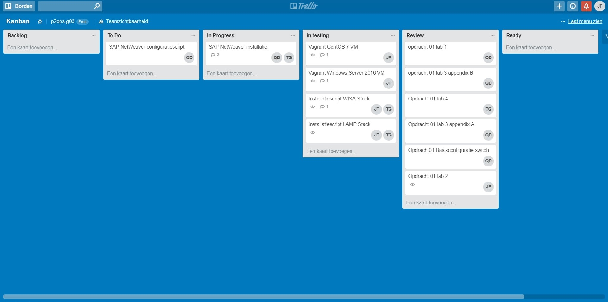

# Voortgangsrapport week 05

* Groep: ops2-g03
* Datum: 12/03/2018

| Student  | Aanw. | Opmerking |
| :---     | :---  | :---      |
| Quinten De Bruyne |  v    |           |
| Jens Du Four |  ziek   | gewettigd, blessure          |
| Tim Grijp |  v    |           |

## Wat heb je deze week gerealiseerd?

### Algemeen

* ...
* ...

[Afbeelding teamoverzicht tijdregistratie onderverdeeld per deelopdracht]

### Quinten De Bruyne

* Manuele installatie van VM openSUSE met SAP abap.

[Afbeelding individueel rapport tijdregistratie](img/Schermopname (2).png)

### Jens Du Four

* Aanvullen van de benodigde informatie op Github: lastenboek, achtergrondinformatie, technische handleiding en handleiding voor gebruikers. Nakijken van alle reeds geuploade documenten.

### Tim Grijp

* Vm geinstalleerd voor SAP, LAMP stack en WISA stack geinstalleerd.

## Wat plan je volgende week te doen?

### Algemeen

### Quinten De Bruyne
* Testplan LAMPstack en testrapport WISA stack schrijven.  
* Installatie SAP Abap op VM automatiseren.
### Jens Du Four
* Laatste stappen naar afwerken opdracht 2. De eerste stappen zetten naar de volgende opdracht.

### Tim Grijp
SAP Installeren en testen/schrijven van de WISA en LAMP installatiescripts

## Waar hebben jullie nog problemen mee?

* * Ik (Tim) krijg momenteel een npl failed error bij installatie van sap.
* ...

## Feedback technisch luik

### Algemeen

Lastenboek: probeer beter de grote lijnen van hoe je de zaken wil gaan aanpakken,
uit te werken.

Netwerkinstellingen: zorg voor een unieke Virtuele interface op de host, zo vermijd je verwarring.
LAMP: de http server moet actief zijn voordat je kan surfen naar het IP adres

Behalve een werkende configuratie

Hint: wees niet met alles tegelijk bezig.

### Quinten De Bruyne
### Jens Du Four
### Tim Grijp

## Feedback analyseluik

### Algemeen

### Quinten De Bruyne
### Jens Du Four
### Tim Grijp
